# Backend Implementation Tasks - MVP-First Roadmap

**Document Version**: 2.0
**Last Updated**: 2025-11-03
**Status**: Reorganized per system_alignment.md - GCS-first, dashboard generation priority

---

## 📋 Document Overview

**Purpose**: Comprehensive task list for backend implementation with metadata-oriented structure, clear goal alignment, and explicit dependencies.

**Alignment Principles**:
1. **Postgres as Directory, GCS as Data Lake** - All long-form content (messages, YAML, artifacts) in GCS; DB stores pointers only
2. **Dashboard Generation via Chat is MVP Priority** - Universal AI SDK → Chat API → Dashboard YAML Generation → Data Serving
3. **No Artifact Generation on the Fly (MVP)** - Defer doc crawl, PII, glossary, governance to post-MVP
4. **Cost Guardrails Before Heavy Jobs** - Byte caps, rate limits, circuit breakers enforced before enabling background jobs

**Key References**:
- **Backend PDR**: `/docs/backend_pdr.md` (architecture authority)
- **System Alignment**: `/docs/system_alignment.md` (strategic direction)
- **Reorganization Plan**: `/docs/task_reorganization_plan.md` (rationale for phase structure)

---

## 📊 Phase Status Summary

| Phase | Goal | Duration | Status | Dependencies | Priority |
|-------|------|----------|--------|--------------|----------|
| **Phase 0** | Minimal Onboarding (Team + Connection) | ~4h | ⏳ Pending | None | High |
| **Phase 1** | Foundation & Setup | ~6h | ✅ Complete | None | High |
| **Phase 2** | Core Services & Business Logic | ~8h | ✅ Complete | Phase 1 | High |
| **Phase 2.12** | Universal AI SDK Infrastructure | ~7h | 📝 Documented | Phase 2 | **Critical** |
| **Phase 3** | Chat API Endpoints (SSE Streaming) | ~1.5h | 📝 Documented | Phase 2.12 | **Critical** |
| **Phase 3.5** | Dashboard YAML Generation via LLM | ~3h | 📝 New | Phase 3 | **🎯 MVP Blocker** |
| **Phase 4** | Dashboard Data Serving & Cache | ~4h | ⏳ Pending | Phase 3.5 | High |
| **Phase 5** | Observability & Monitoring | ~3h | ⏳ Pending | Phase 4 | Medium |
| **Phase 6** | Deployment & CI/CD | ~2h | ⏳ Pending | Phase 5 | Medium |
| **Phase X** | Advanced Onboarding (Deferred) | ~20h | ⏸️ Post-MVP | Phase 2.12 | Low |
| **Phase Y** | Artifacts & Lineage (Deferred) | ~8h | ⏸️ Post-MVP | Phase X | Low |

**Total MVP Path**: ~35 hours (Phases 0, 1, 2, 2.12, 3, 3.5, 4, 5, 6)
**Total with Deferred**: ~63 hours (includes Phase X, Y)

---

## 🎯 MVP Critical Path

```mermaid
graph LR
    A[Phase 0: Minimal Onboarding] --> B[Phase 1: Foundation ✅]
    B --> C[Phase 2: Core Services ✅]
    C --> D[Phase 2.12: Universal AI SDK]
    D --> E[Phase 3: Chat API]
    E --> F[Phase 3.5: Dashboard Gen 🎯]
    F --> G[Phase 4: Data Serving]
    G --> H[Phase 5: Observability]
    H --> I[Phase 6: Deployment]
```



**MVP Success Criteria**: User can chat with LLM → LLM generates dashboard YAML → YAML saved to GCS → Dashboard renders with live data

---

## Phase 0: Minimal Onboarding (Team + Connection + Lightweight Catalog)

**Goal**: Enable team creation, BigQuery connection validation, and basic dataset discovery without heavy processing.

**Duration**: ~4 hours
**Priority**: HIGH - Prerequisite for dashboard creation
**Status**: ⏳ PENDING
**Dependencies**: None
**PDR Reference**: Backend PDR §0 (Team Onboarding - Trimmed)

**Alignment Note**: ✅ This phase has been **trimmed from 17 tables → 4 tables** and **11 services → 4 services** to comply with "Postgres as directory, GCS as data lake" and defer complexity to post-MVP phases.

**Deferred to Phase X (Post-MVP)**:
- ❌ Column model (schema exploration)
- ❌ PIIDetection, DbtArtifact, DocSource, GlossaryTerm, BusinessGoal, DataPolicy
- ❌ OnboardingReport, OnboardingJob, WorkspacePreferences
- ❌ Doc crawler, PII detector, glossary extraction, governance services

---

### 0.1 Database Models & Migrations (Minimal Schema)

**Duration**: 1.5 hours
**Goal**: Create lightweight team/connection schema with GCS pointers only

**Database Tables (4 total - Postgres as Directory)**:

#### 0.1.1 Team Model
- [ ] Create `Team` SQLModel with fields:
  - `id` (UUID, primary key)
  - `name` (String, required)
  - `slug` (String, unique, lowercase-hyphenated)
  - `admin_user_id` (UUID, FK → users.id)
  - `settings` (JSONB, default: {})
  - `created_at`, `updated_at` (timestamps)
- [ ] Add index: `idx_team_slug` (slug UNIQUE)
- [ ] Add index: `idx_team_admin` (admin_user_id)

**Acceptance Criteria**:
- ✓ Team creation generates unique slug from name
- ✓ One user designated as admin per team
- ✓ Settings stored as flexible JSONB (future customization)

#### 0.1.2 Connection Model
- [ ] Create `Connection` SQLModel with fields:
  - `id` (UUID, primary key)
  - `team_id` (UUID, FK → teams.id ON DELETE CASCADE)
  - `name` (String, required, e.g., "Production BigQuery")
  - `warehouse_type` (Enum: "bigquery", future: "snowflake")
  - `credentials_gcs_path` (String, **GCS pointer**, e.g., `gs://bridge-credentials/{team_id}/service-account.json.enc`)
  - `status` (Enum: "pending_validation", "validated", "failed")
  - `validation_error` (Text, nullable)
  - `validated_at` (Timestamp, nullable)
  - `created_at`, `updated_at` (timestamps)
- [ ] Add index: `idx_team_connections` (team_id, created_at DESC)
- [ ] Add index: `idx_connection_status` (status, validated_at DESC)

**Acceptance Criteria**:
- ✓ Credentials stored in GCS (encrypted), NOT in Postgres
- ✓ Postgres stores GCS path pointer only
- ✓ Status tracks validation lifecycle

#### 0.1.3 Dataset Model (Catalog Metadata Only)
- [ ] Create `Dataset` SQLModel with fields:
  - `id` (UUID, primary key)
  - `connection_id` (UUID, FK → connections.id ON DELETE CASCADE)
  - `fully_qualified_name` (String, e.g., "my-project.analytics_prod")
  - `description` (Text, nullable, from INFORMATION_SCHEMA)
  - `location` (String, e.g., "us-central1")
  - `last_modified` (Timestamp, from BigQuery metadata)
  - `created_at`, `updated_at` (timestamps)
- [ ] Add unique constraint: `(connection_id, fully_qualified_name)`
- [ ] Add index: `idx_connection_datasets` (connection_id, last_modified DESC)

**Acceptance Criteria**:
- ✓ Datasets populated from BigQuery INFORMATION_SCHEMA
- ✓ Lightweight metadata only (no columns, no lineage yet)

#### 0.1.4 Table Model (Catalog Metadata Only)
- [ ] Create `Table` SQLModel with fields:
  - `id` (UUID, primary key)
  - `dataset_id` (UUID, FK → datasets.id ON DELETE CASCADE)
  - `fully_qualified_name` (String, e.g., "my-project.analytics_prod.revenue_daily")
  - `table_type` (Enum: "TABLE", "VIEW", "MATERIALIZED_VIEW", "EXTERNAL")
  - `row_count` (BigInteger, nullable, from INFORMATION_SCHEMA)
  - `size_bytes` (BigInteger, nullable, for cost estimation)
  - `partitioning` (JSONB, nullable, e.g., `{"type": "DAY", "field": "date"}`)
  - `clustering` (JSONB, nullable, e.g., `{"fields": ["region", "product_id"]}`)
  - `last_modified` (Timestamp, from BigQuery metadata)
  - `created_at`, `updated_at` (timestamps)
- [ ] Add unique constraint: `(dataset_id, fully_qualified_name)`
- [ ] Add index: `idx_dataset_tables` (dataset_id, table_type, last_modified DESC)

**Acceptance Criteria**:
- ✓ Tables populated from BigQuery INFORMATION_SCHEMA
- ✓ Partitioning/clustering metadata stored for query optimization hints
- ✓ Row count and size for cost estimation

#### 0.1.5 Alembic Migration & Testing
- [ ] Create Alembic migration: `alembic revision --autogenerate -m "Phase 0: Minimal Onboarding Schema"`
- [ ] Test migration up: `alembic upgrade head` (verify all tables created)
- [ ] Test migration down: `alembic downgrade -1` (verify rollback works)
- [ ] Seed test data: Create 1 Team, 1 Connection (validated), 2 Datasets, 5 Tables
- [ ] Document migration in `/docs/migrations/phase_0_minimal_onboarding.md`

**Acceptance Criteria**:
- ✓ Migration runs without errors
- ✓ Rollback restores previous state
- ✓ Test data insertable via ORM
- ✓ All foreign keys enforced

---

### 0.2 Infrastructure Setup - Cloud KMS & GCS (Credentials Only)

**Duration**: 1 hour
**Goal**: Secure credential storage in GCS with KMS encryption

#### 0.2.1 GCS Bucket for Credentials
- [ ] Create GCS bucket: `gs://bridge-credentials-{env}/` (separate bucket for security)
- [ ] Configure bucket lifecycle: 365-day retention, no auto-expiration
- [ ] Set GCS IAM: API service account has `Storage Object Admin` role
- [ ] Enable bucket versioning (for credential rotation tracking)
- [ ] Configure uniform bucket-level access (disable legacy ACLs)

**Acceptance Criteria**:
- ✓ Bucket isolated from other data (session logs, dashboards)
- ✓ Lifecycle policy prevents accidental deletion
- ✓ Versioning enabled for audit trail

#### 0.2.2 Cloud KMS Setup
- [ ] Create Cloud KMS key ring: `projects/{PROJECT_ID}/locations/us-central1/keyRings/bridge-credentials`
- [ ] Create crypto key: `bridge-credentials/cryptoKeys/service-account-encryption`
- [ ] Configure key rotation policy: 90 days
- [ ] Set KMS IAM: API service account has `Cloud KMS CryptoKey Encrypter/Decrypter` role
- [ ] Add environment variables to `config.py`:
  - `CREDENTIALS_BUCKET` (e.g., "bridge-credentials-dev")
  - `KMS_KEY_NAME` (full resource name)

**Acceptance Criteria**:
- ✓ Encrypt/decrypt round-trip works
- ✓ Key rotation policy enforced
- ✓ Service account has minimal permissions (no `cloudkms.admin`)

#### 0.2.3 Secret Manager for API Keys
- [ ] Store Anthropic API key: `projects/{PROJECT_ID}/secrets/anthropic-api-key`
- [ ] Add Secret Manager read permissions for API service account
- [ ] Add environment variable to `config.py`:
  - `ANTHROPIC_API_KEY_SECRET` (secret resource name)
- [ ] Create helper function in `src/core/secrets.py`: `async get_secret(secret_name) -> str`

**Acceptance Criteria**:
- ✓ Secrets loaded from Secret Manager (not environment variables in production)
- ✓ Local dev fallback: if secret not found, use `.env` file
- ✓ No secrets hardcoded in code or checked into Git

---

### 0.3 Core Services Implementation (Minimal Set)

**Duration**: 1.5 hours
**Goal**: Implement essential services for team/connection management

#### 0.3.1 Encryption Service
**File**: `src/services/encryption_service.py`

- [ ] Create `EncryptionService` class with constructor injection:
  - `__init__(self, kms_key_name: str)`
- [ ] Implement `async encrypt(plaintext: bytes) -> bytes`:
  - Call Cloud KMS `encrypt()` method
  - Return ciphertext bytes
- [ ] Implement `async decrypt(ciphertext: bytes) -> bytes`:
  - Call Cloud KMS `decrypt()` method
  - Return plaintext bytes
- [ ] Add error handling:
  - `KMSQuotaExceeded` → raise `ServiceUnavailableError` with retry-after
  - `InvalidCiphertext` → raise `ValidationError`
- [ ] Add unit tests with mocked KMS client

**Acceptance Criteria**:
- ✓ Encrypt/decrypt round-trip succeeds
- ✓ Invalid ciphertext raises clear error
- ✓ Quota exhaustion handled gracefully

#### 0.3.2 GCS Storage Service (Credentials Only)
**File**: `src/services/storage_service.py`

- [ ] Create `StorageService` class with constructor injection:
  - `__init__(self, bucket_name: str, encryption_service: EncryptionService)`
- [ ] Implement `async upload_service_account(team_id: UUID, file_content: bytes) -> str`:
  - Encrypt file_content using `encryption_service.encrypt()`
  - Generate GCS path: `gs://{bucket}/{team_id}/service-account.json.enc`
  - Upload encrypted bytes to GCS
  - Return GCS path (for storing in Connection.credentials_gcs_path)
- [ ] Implement `async download_service_account(gcs_path: str) -> bytes`:
  - Download encrypted bytes from GCS
  - Decrypt using `encryption_service.decrypt()`
  - Return plaintext service account JSON bytes
- [ ] Implement `async delete_service_account(gcs_path: str)`:
  - Delete object from GCS
  - Log deletion for audit trail
- [ ] Add retry logic: 3 retries with exponential backoff (2s, 4s, 8s)
- [ ] Add unit tests with mocked GCS client

**Acceptance Criteria**:
- ✓ Credentials uploaded and encrypted in GCS
- ✓ Download/decrypt returns original plaintext
- ✓ Retry logic handles transient failures
- ✓ Deletion succeeds even if object doesn't exist (idempotent)

#### 0.3.3 Connection Service
**File**: `src/services/connection_service.py`

- [ ] Create `ConnectionService` class with constructor injection:
  - `__init__(self, db: AsyncSession, storage_service: StorageService)`
- [ ] Implement `async create_connection(team_id, name, warehouse_type, credentials_file_content) -> Connection`:
  - Validate JSON structure: must have `project_id`, `client_email`, `private_key`
  - Upload credentials to GCS via `storage_service.upload_service_account()`
  - Create `Connection` record with `credentials_gcs_path`, status="pending_validation"
  - Return connection object
- [ ] Implement `async validate_connection(connection_id: UUID) -> dict`:
  - Download and decrypt credentials via `storage_service.download_service_account()`
  - Initialize BigQuery client with credentials
  - Run test query: `SELECT 1` with `dry_run=True` (0 bytes billed)
  - Check required permissions: `bigquery.datasets.get`, `bigquery.tables.list`, `bigquery.jobs.create`
  - Update Connection.status to "validated" or "failed"
  - Store validation_error if failed
  - Return: `{status: "validated", validated_at: timestamp}` or `{status: "failed", error: message}`
- [ ] Implement `async list_connections(team_id: UUID) -> List[Connection]`:
  - Query connections filtered by team_id
  - Order by created_at DESC
- [ ] Implement `async delete_connection(connection_id: UUID)`:
  - Load connection record
  - Delete credentials from GCS via `storage_service.delete_service_account()`
  - Delete connection record from DB
- [ ] Add error handling:
  - Malformed JSON → `ValidationError`
  - Insufficient BigQuery permissions → `AuthorizationError`
  - Network errors → `ServiceUnavailableError` with retry hint

**Acceptance Criteria**:
- ✓ Connection created with encrypted credentials in GCS
- ✓ Validation runs dry-run query successfully
- ✓ Failed validation stores clear error message
- ✓ Deletion removes both GCS file and DB record

#### 0.3.4 Catalog Scanner Service (Lightweight - Datasets + Tables Only)
**File**: `src/services/catalog_service.py`

- [ ] Create `CatalogService` class with constructor injection:
  - `__init__(self, db: AsyncSession, storage_service: StorageService)`
- [ ] Implement `async scan_catalog(connection_id: UUID) -> dict`:
  - Download and decrypt credentials
  - Initialize BigQuery client
  - Query `INFORMATION_SCHEMA.SCHEMATA`:
    ```sql
    SELECT schema_name, location, creation_time
    FROM `{project_id}.region-us.INFORMATION_SCHEMA.SCHEMATA`
    ```
  - Create or update `Dataset` records (upsert by fully_qualified_name)
  - Query `INFORMATION_SCHEMA.TABLES`:
    ```sql
    SELECT table_catalog, table_schema, table_name, table_type,
           creation_time, row_count, size_bytes
    FROM `{project_id}.region-us.INFORMATION_SCHEMA.TABLES`
    ```
  - Create or update `Table` records (upsert by fully_qualified_name)
  - Query `INFORMATION_SCHEMA.TABLE_STORAGE` for partitioning/clustering metadata
  - Return summary: `{datasets_scanned: N, tables_scanned: M, duration_ms: X}`
- [ ] Add progress tracking: Update a status dict as scan progresses (for future polling)
- [ ] Add error handling:
  - BigQuery API errors → capture error, continue scanning remaining datasets (partial failure)
  - Network timeout → retry 3 times, then fail gracefully
- [ ] Add unit tests with mocked BigQuery client

**Acceptance Criteria**:
- ✓ All accessible datasets discovered
- ✓ All tables cataloged with row count and size
- ✓ Partitioning/clustering metadata captured
- ✓ Scan completes in <30s for 100 datasets
- ✓ Partial failures don't block entire scan

**Note**: ❌ Column-level scanning deferred to Phase X (not needed for MVP dashboard generation)

---

### 0.4 API Endpoints (Minimal Set)

**Duration**: 1 hour
**Goal**: Expose team/connection management endpoints

#### 0.4.1 Team Management Endpoints
**File**: `src/api/v1/onboarding/teams.py`

- [ ] `POST /v1/onboarding/teams` - Create new team
  - Request: `{name: str}`
  - Generates slug from name (lowercase, hyphenated, unique)
  - Links current user as admin via `Team.admin_user_id`
  - Response: `{id, name, slug, admin_user_id, created_at}`
  - Status: 201 Created

- [ ] `GET /v1/onboarding/teams/{team_id}` - Get team details
  - Requires: User is team member
  - Response: `{id, name, slug, admin_user_id, settings, created_at, updated_at}`
  - Status: 200 OK, 403 Forbidden, 404 Not Found

- [ ] `PATCH /v1/onboarding/teams/{team_id}` - Update team settings
  - Requires: User is team admin
  - Request: `{name?: str, settings?: dict}`
  - Response: Updated team object
  - Status: 200 OK, 403 Forbidden

**Acceptance Criteria**:
- ✓ Team creation enforces unique slug
- ✓ User can only access teams they belong to
- ✓ Admin-only operations enforce role check

#### 0.4.2 Connection Endpoints
**File**: `src/api/v1/onboarding/connections.py`

- [ ] `POST /v1/onboarding/connections` - Create connection
  - Request: `{team_id: UUID, name: str, warehouse_type: "bigquery", credentials_file: base64_string}`
  - Decodes base64 credentials file
  - Calls `connection_service.create_connection()`
  - Response: `{id, team_id, name, warehouse_type, status: "pending_validation", created_at}`
  - Status: 201 Created, 400 Bad Request (invalid JSON)

- [ ] `POST /v1/onboarding/connections/{connection_id}/validate` - Trigger validation
  - Requires: User is team member
  - Calls `connection_service.validate_connection()`
  - Response: `{status: "validated"|"failed", validated_at?, validation_error?}`
  - Status: 200 OK, 403 Forbidden

- [ ] `GET /v1/onboarding/connections` - List connections for team
  - Query param: `team_id` (required)
  - Requires: User is team member
  - Calls `connection_service.list_connections(team_id)`
  - Response: `{connections: [{id, name, status, validated_at, created_at}, ...]}`
  - Status: 200 OK, 403 Forbidden

- [ ] `DELETE /v1/onboarding/connections/{connection_id}` - Delete connection
  - Requires: User is team admin
  - Calls `connection_service.delete_connection()`
  - Response: `{success: true}`
  - Status: 204 No Content, 403 Forbidden

**Acceptance Criteria**:
- ✓ Credentials never exposed in API responses
- ✓ Validation runs asynchronously (returns immediately)
- ✓ Delete removes both GCS file and DB record
- ✓ User can only manage connections for their teams

#### 0.4.3 Catalog Endpoints
**File**: `src/api/v1/onboarding/catalog.py`

- [ ] `POST /v1/onboarding/catalog/scan` - Trigger catalog scan
  - Request: `{connection_id: UUID}`
  - Requires: User is team member, connection is validated
  - Calls `catalog_service.scan_catalog()` (runs synchronously for MVP)
  - Response: `{datasets_scanned: N, tables_scanned: M, duration_ms: X}`
  - Status: 200 OK, 400 Bad Request (connection not validated), 403 Forbidden

- [ ] `GET /v1/onboarding/catalog/datasets` - List datasets
  - Query param: `connection_id` (required)
  - Requires: User is team member
  - Queries datasets filtered by connection_id
  - Response: `{datasets: [{id, fully_qualified_name, description, location, last_modified}, ...]}`
  - Status: 200 OK, 403 Forbidden

- [ ] `GET /v1/onboarding/catalog/tables` - List tables
  - Query param: `dataset_id` (required)
  - Requires: User is team member
  - Queries tables filtered by dataset_id
  - Response: `{tables: [{id, fully_qualified_name, table_type, row_count, size_bytes, partitioning, last_modified}, ...]}`
  - Status: 200 OK, 403 Forbidden

**Acceptance Criteria**:
- ✓ Scan triggers only for validated connections
- ✓ Catalog data available immediately after scan
- ✓ Tables include partitioning/clustering hints for LLM

---

### 0.5 Phase 0 Completion Checklist

- [ ] Database migration runs successfully (`alembic upgrade head`)
- [ ] GCS bucket created with correct IAM permissions
- [ ] KMS key created with rotation policy
- [ ] Anthropic API key stored in Secret Manager
- [ ] All 4 services implemented with unit tests
- [ ] All 8 API endpoints functional (Postman/cURL tested)
- [ ] Team creation → Connection creation → Validation → Catalog scan flow works end-to-end
- [ ] Credentials encrypted in GCS, never exposed in API responses
- [ ] Test data seeded for local development

**Phase 0 Acceptance Criteria**:
- ✅ User can create team and validate BigQuery connection
- ✅ Catalog scan populates datasets and tables (no columns yet)
- ✅ All credentials stored in GCS with KMS encryption
- ✅ Postgres stores only 4 tables (Team, Connection, Dataset, Table)
- ✅ No doc crawl, PII detection, glossary, or governance logic (deferred to Phase X)

---

## Phase 1: Foundation & Setup ✅

**Goal**: Establish FastAPI application structure, database layer, BigQuery client, cache interface.

**Duration**: ~6 hours
**Priority**: HIGH - Foundation for all backend work
**Status**: ✅ COMPLETE (2025-10-30)
**Dependencies**: None
**PDR Reference**: Backend PDR §1, §2

**Completed Deliverables**:
- ✅ Project structure created (`src/`, `tests/`, `alembic/`)
- ✅ `pyproject.toml` with uv package management
- ✅ Configuration system (`config.py`) with Secret Manager integration
- ✅ SQLModel for database models (Pydantic + SQLAlchemy)
- ✅ OpenAPI spec definition (SSOT for API models)
- ✅ Alembic migration setup with SQLModel
- ✅ Database connection & session management (async)
- ✅ BigQuery client wrapper with guardrails (max_bytes_billed, dry_run)
- ✅ Cache interface (in-memory + Redis adapter)

**Notes**:
- Using SQLModel for type-safe ORM with async support
- OpenAPI spec auto-generates Pydantic models for API contracts
- Frontend TypeScript client auto-generated from OpenAPI spec

---

## Phase 2: Core Services & Business Logic ✅

**Goal**: Implement business logic services for YAML validation, dashboard compilation, SQL execution, data serving, lineage, auth.

**Duration**: ~8 hours
**Priority**: HIGH - Enables dashboard workflows
**Status**: ✅ COMPLETE (2025-10-30)
**Dependencies**: Phase 1
**PDR Reference**: Backend PDR §3-§8

**Completed Deliverables**:
- ✅ Service-based architecture (`/src/services/` directory)
- ✅ ResponseFactory pattern (`/src/core/response.py`)
- ✅ Custom exception hierarchy (`/src/core/exceptions.py`)
- ✅ Service factories (`/src/core/dependencies.py`)
- ✅ 10 service classes implemented:
  - `YAMLValidationService` - JSON Schema + query ref validation
  - `DashboardCompilerService` - YAML → execution plan
  - `SQLExecutorService` - BigQuery query execution with guardrails
  - `DataServingService` - Cache-first data serving
  - `PrecomputeService` - Manual cache warming
  - `StorageService` - Filesystem YAML storage (MVP)
  - `LineageService` - Graph generation from YAML
  - `AuthenticationService` - Google OAuth flow
  - `SessionService` - Session management
  - `DashboardService` - Dashboard CRUD operations

**Notes**:
- Full type annotations with async/await
- Constructor dependency injection pattern
- PDR section references in docstrings
- Structured JSON logging with correlation IDs (replaces emoji logging)

### 2.10 Guardrails & Cache Controls (Pending Hardening)
- [ ] Harden SQL execution: sanitize statements, block destructive keywords (DROP, DELETE, TRUNCATE)
- [ ] Enforce dataset allowlist by environment (prevent LLM from touching unauthorized datasets)
- [ ] Normalize cache key prefixes: `dash:{slug}:q:{hash}:v:{version}` (consistent across services)
- [ ] Implement cache TTL enforcement + admin purge endpoint

### 2.11 Storage Integrity Safeguards (Pending)
- [ ] Add YAML/Postgres index drift monitor job (scheduled check)
- [ ] Provide CLI/CI script for dashboard index validation (run pre-deploy)
- [ ] Document manual remediation flow for drift detection (runbook entry)

---

## Phase 2.12: Universal AI SDK Infrastructure 🎯

**Goal**: Implement GCS-backed session storage, model call logging, deterministic tool caching, and prompt block registry to enable LLM-driven dashboard creation with cost tracking.

**Duration**: ~7 hours
**Priority**: **CRITICAL - Blocks Frontend Phase 1.5 & Phase 3**
**Status**: 📝 Documented, ready for implementation
**Dependencies**: Phase 2 complete
**PDR Reference**: Backend PDR §3.1, §4.1, §5.2-§5.3, §7.1
**Alignment**: system_alignment.md lines 48-60

**Context**: This phase shifts backend from stateless API to Universal AI SDK orchestrator. All session state moves to GCS (JSONL logs), Postgres stores only pointers and metadata. Enables streaming chat, tool execution, and cost tracking.

---

### 2.12.1 Database Schema - Universal AI SDK Tables

**Duration**: 1.5 hours
**Goal**: Create 5 new tables for session manifest, model calls, tool cache, artifacts, prompt blocks
**Files**: `src/models/db_models.py`, new Alembic migration

#### Session Manifest Table
- [ ] Create `SessionManifest` SQLModel (Postgres pointer to GCS):
  - **Fields**:
    - `id` (UUID, primary key)
    - `tenant_id` (UUID, nullable, future multi-tenancy)
    - `user_id` (UUID, FK → users.id, required)
    - `team_id` (UUID, FK → teams.id, nullable, links session to team context)
    - `dashboard_id` (UUID, FK → dashboards.id, nullable, links to generated dashboard)
    - `gcs_messages_uri` (String, **GCS pointer**, e.g., `gs://bridge-sessions/{session_id}/messages-0001.jsonl`)
    - `summary` (Text, nullable, rolling summary of conversation <500 chars)
    - `provider` (Enum: "anthropic", "openai", "google")
    - `model` (String, e.g., "claude-sonnet-4-5")
    - `total_tokens` (Integer, cumulative across all model calls)
    - `total_cost_usd` (Decimal(10,4), cumulative cost)
    - `status` (Enum: "active", "archived", "error")
    - `created_at`, `updated_at`, `last_message_at` (timestamps)
  - **Foreign Keys**:
    - `user_id` → `users.id` (required)
    - `team_id` → `teams.id` (nullable)
    - `dashboard_id` → `dashboards.id` (nullable, set when dashboard generated)
  - **Indexes**:
    - `idx_user_sessions` (user_id, created_at DESC) - user's recent sessions
    - `idx_session_status` (status, created_at DESC) - active sessions
    - `idx_team_sessions` (team_id, created_at DESC) - team context

**Acceptance Criteria**:
- ✓ GCS URI points to JSONL message log, NOT stored in DB
- ✓ Summary field for quick context preview (<500 chars)
- ✓ Cost tracking at session level (aggregate of model_calls)

#### Model Call Tracking Table
- [ ] Create `ModelCall` SQLModel (token/cost tracking):
  - **Fields**:
    - `id` (UUID, primary key)
    - `session_id` (UUID, FK → sessions.id ON DELETE CASCADE)
    - `provider` (Enum: "anthropic", "openai", "google")
    - `model` (String, e.g., "claude-sonnet-4-5")
    - `input_tokens` (Integer, required)
    - `output_tokens` (Integer, required)
    - `cached_input_tokens` (Integer, default 0, for Anthropic prompt caching)
    - `cost_usd` (Decimal(10,6), calculated from provider pricing)
    - `latency_ms` (Integer, time from request to first token)
    - `cache_hit` (Boolean, default False, for tool cache hits)
    - `error` (Text, nullable, if call failed)
    - `purpose` (String, e.g., "dashboard_generation", "glossary_extraction")
    - `executed_at` (Timestamp, required)
  - **Foreign Keys**:
    - `session_id` → `sessions.id` ON DELETE CASCADE
  - **Indexes**:
    - `idx_session_calls` (session_id, executed_at DESC) - session's call history
    - `idx_cost_tracking` (executed_at DESC, cost_usd) - cost aggregation queries

**Acceptance Criteria**:
- ✓ Every LLM API call logged with tokens and cost
- ✓ Cached input tokens tracked separately (Anthropic prompt caching)
- ✓ Purpose field enables cost attribution by feature

#### Tool Cache Table
- [ ] Create `ToolCache` SQLModel (deterministic cache):
  - **Fields**:
    - `id` (UUID, primary key)
    - `tenant_id` (UUID, nullable, future multi-tenancy)
    - `tool_name` (String, e.g., "list_datasets", "run_query")
    - `cache_key` (String, SHA-256 hash of canonical args, e.g., `"tool:list_datasets:abc123..."`)
    - `version` (Integer, default 1, for cache invalidation)
    - `gcs_payload_uri` (String, **GCS pointer**, e.g., `gs://bridge-cache/{tenant_id}/{tool_name}/{cache_key}.json`)
    - `ttl_seconds` (Integer, e.g., 86400 for 24 hours)
    - `expires_at` (Timestamp, calculated: created_at + ttl_seconds)
    - `hit_count` (Integer, default 0, incremented on each cache hit)
    - `last_accessed` (Timestamp, updated on each hit)
    - `created_at` (Timestamp)
  - **Unique Constraint**: `cache_key` (enforce deduplication)
  - **Indexes**:
    - `idx_cache_lookup` (cache_key, expires_at) - fast cache hit check
    - `idx_tool_cache` (tool_name, created_at DESC) - cache analytics per tool

**Acceptance Criteria**:
- ✓ Cache key is deterministic SHA-256 hash (same args → same key)
- ✓ Payload stored in GCS, Postgres has pointer only
- ✓ Expiry enforced via `expires_at` check
- ✓ Hit count tracks cache effectiveness

#### Artifact Deduplication Table
- [ ] Create `Artifact` SQLModel (SHA-256 index):
  - **Fields**:
    - `id` (UUID, primary key)
    - `tenant_id` (UUID, nullable)
    - `session_id` (UUID, FK → sessions.id, nullable, origin session)
    - `artifact_type` (String, e.g., "yaml", "sql", "image", "pdf")
    - `content_sha256` (String, 64-char hex, for deduplication)
    - `gcs_uri` (String, **GCS pointer**, e.g., `gs://bridge-sessions/{session_id}/artifacts/{sha256}.bin`)
    - `size_bytes` (BigInteger, for quota tracking)
    - `mime_type` (String, e.g., "text/yaml", "application/json")
    - `metadata` (JSONB, flexible metadata like {filename, description})
    - `deduplicated` (Boolean, default False, set True if reused existing artifact)
    - `created_at` (Timestamp)
  - **Unique Constraint**: `content_sha256` (prevent duplicate storage)
  - **Indexes**:
    - `idx_session_artifacts` (session_id, created_at DESC) - session's artifacts
    - `idx_artifact_sha` (content_sha256) - deduplication lookup

**Acceptance Criteria**:
- ✓ Same content → same SHA-256 → single GCS object
- ✓ Deduplication flag tracks reuse
- ✓ Metadata stored as flexible JSONB

#### Prompt Block Registry Table
- [ ] Create `PromptBlock` SQLModel (registry with cache metadata):
  - **Fields**:
    - `id` (UUID, primary key)
    - `block_name` (String, unique, e.g., "system_prompt_dashboard_creation")
    - `block_type` (Enum: "system", "user_template", "context")
    - `content` (Text, the actual prompt text, can be large)
    - `version` (Integer, for versioning prompt updates)
    - `cache_control_type` (Enum: "ephemeral", "permanent", null, for Anthropic caching)
    - `is_active` (Boolean, default True, for A/B testing prompts)
    - `created_at`, `updated_at` (timestamps)
  - **Unique Constraint**: `block_name` (enforce unique names)
  - **Indexes**:
    - `idx_block_name` (block_name, version DESC) - lookup active version

**Acceptance Criteria**:
- ✓ Prompt blocks stored in DB (not GCS, for fast retrieval)
- ✓ Cache control type enables Anthropic prompt caching (90% cost reduction)
- ✓ Versioning supports prompt iteration without breaking existing sessions

#### Migration & Seeding
- [ ] Create Alembic migration: `alembic revision --autogenerate -m "Add Universal AI SDK schema"`
- [ ] Write up/down migration tests
- [ ] Seed 3 initial prompt blocks:
  1. **system_prompt_dashboard_creation** (type: system, cache_control: ephemeral):
     - Content: Dashboard YAML schema definition, BigQuery best practices, layout rules
  2. **bigquery_schema_context** (type: context, cache_control: ephemeral):
     - Content: Template for injecting dataset/table schema into prompt
  3. **context_budget_policy** (type: system, cache_control: null):
     - Content: Rolling summary policy, context window management rules

**Acceptance Criteria**:
- ✓ All 5 tables created with proper relationships
- ✓ Migrations run without errors (`alembic upgrade head`)
- ✓ SQLModel models fully typed with relationships
- ✓ Foreign keys validated
- ✓ Indexes improve query performance (benchmark: session queries <100ms)
- ✓ Seed data insertable for local dev/testing

---

### 2.12.2 GCS Storage Adapter Service

**Duration**: 1.5 hours
**Goal**: Abstract GCS operations for session logs, artifacts, and tool cache payloads
**File**: `src/services/gcs_adapter_service.py`

- [ ] Create `GCSAdapterService` class with constructor injection:
  - `__init__(self, db: AsyncSession, bucket_sessions: str, bucket_cache: str)`

#### Session Message Log Operations
- [ ] Implement `async upload_session_message(session_id: UUID, message_obj: dict) -> str`:
  - **Logic**:
    1. Load SessionManifest from DB to get current GCS URI
    2. If GCS URI doesn't exist yet, create first chunk: `gs://bridge-sessions/{session_id}/messages-0001.jsonl`
    3. Append message as JSONL line to current chunk
    4. Track token count (estimate: ~4 chars per token)
    5. If chunk exceeds 10K tokens or 1000 messages, rotate to new chunk: `messages-0002.jsonl`
    6. Update SessionManifest.gcs_messages_uri to point to latest chunk
  - **Return**: GCS URI of written chunk
  - **Error Handling**: Retry 3x with exponential backoff (2s, 4s, 8s)

- [ ] Implement `async download_session_messages(session_id: UUID, limit: int = 100, offset: int = 0) -> List[dict]`:
  - **Logic**:
    1. Load SessionManifest to get GCS URI pattern
    2. List all message chunks for session (messages-0001.jsonl, messages-0002.jsonl, ...)
    3. Read chunks in reverse order (newest first)
    4. Parse JSONL, skip `offset` messages, collect `limit` messages
    5. Handle multi-chunk sessions (read across files)
  - **Return**: List of message dicts (most recent first)
  - **Error Handling**: If chunk missing, log warning and continue with available chunks

**Acceptance Criteria**:
- ✓ Messages append to GCS JSONL files successfully
- ✓ Chunk rotation prevents files from growing unbounded
- ✓ Messages retrievable with pagination (limit/offset)
- ✓ Multi-chunk sessions readable transparently

#### Artifact Operations
- [ ] Implement `async upload_artifact(content: bytes, artifact_type: str, session_id: UUID, metadata: dict = None) -> Artifact`:
  - **Logic**:
    1. Calculate SHA-256 hash of content
    2. Query `artifacts` table: `SELECT * FROM artifacts WHERE content_sha256 = ?`
    3. If exists: Increment reference count, set `deduplicated=True`, return existing Artifact
    4. If new:
       - Upload to GCS: `gs://bridge-sessions/{session_id}/artifacts/{sha256}.bin`
       - Create Artifact record with gcs_uri, size_bytes, mime_type, metadata
       - Return new Artifact
  - **Return**: Artifact object (either existing or newly created)
  - **Deduplication**: Same content across sessions → single GCS object

- [ ] Implement `async download_artifact(artifact_id: UUID) -> bytes`:
  - Load Artifact record from DB
  - Download content from GCS URI
  - Return bytes

**Acceptance Criteria**:
- ✓ Artifacts deduplicated by SHA-256 (same content → same GCS object)
- ✓ Deduplication flag set correctly
- ✓ Multiple sessions can reference same artifact

#### Tool Cache Operations
- [ ] Implement `async upload_tool_cache_payload(tool_name: str, cache_key: str, payload: dict, ttl_seconds: int) -> str`:
  - **Logic**:
    1. Serialize payload as JSON
    2. Upload to GCS: `gs://{bucket_cache}/{tenant_id}/{tool_name}/{cache_key}.json`
    3. Create `ToolCache` record with expires_at = NOW() + ttl_seconds
  - **Return**: GCS URI

- [ ] Implement `async get_tool_cache_payload(cache_key: str) -> Optional[dict]`:
  - **Logic**:
    1. Query `tool_cache` table: `SELECT * FROM tool_cache WHERE cache_key = ? AND expires_at > NOW()`
    2. If not found or expired: return None
    3. If found: Download JSON from gcs_payload_uri, increment hit_count, update last_accessed
  - **Return**: Payload dict or None

**Acceptance Criteria**:
- ✓ Tool cache payloads stored with correct TTL
- ✓ Expired entries not returned (enforced via expires_at check)
- ✓ Hit count increments on each access
- ✓ Retry logic handles transient GCS failures

#### Utility Methods
- [ ] Implement `async configure_bucket_lifecycle()`:
  - Set lifecycle rule: Delete objects in `gs://bridge-cache/` after 30 days (TTL enforcement)
  - Set lifecycle rule: Archive objects in `gs://bridge-sessions/` after 90 days (long-term storage)

- [ ] Add unit tests with mocked GCS client (`unittest.mock`)

**Acceptance Criteria**:
- ✓ All GCS operations use retry logic
- ✓ Bucket lifecycle configured correctly
- ✓ Unit tests cover happy path + error cases
- ✓ Service injectable for testing (constructor DI)

---

### 2.12.3 Universal AI SDK Orchestrator Service

**Duration**: 2 hours
**Goal**: Implement LLM orchestration with streaming, tool execution, context management
**File**: `src/services/ai_sdk_orchestrator.py`

- [ ] Create `AISDKOrchestrator` class with constructor injection:
  - `__init__(self, db: AsyncSession, gcs_adapter: GCSAdapterService, anthropic_api_key: str)`

#### Core Orchestration Methods
- [ ] Implement `async create_session(user_id: UUID, team_id: UUID = None, provider: str = "anthropic", model: str = "claude-sonnet-4-5", tools: List[str] = None) -> SessionManifest`:
  - **Logic**:
    1. Generate session_id (UUID)
    2. Create SessionManifest record with status="active", provider, model
    3. Initialize GCS path: `gs://bridge-sessions/{session_id}/messages-0001.jsonl`
    4. Store initial system message with prompt blocks
  - **Return**: SessionManifest object

- [ ] Implement `async send_message(session_id: UUID, user_message: str, tools: List[str] = None) -> AsyncGenerator[dict, None]`:
  - **Logic** (Streaming SSE):
    1. Load SessionManifest from DB
    2. Load last 20 messages from GCS via `gcs_adapter.download_session_messages(limit=20)`
    3. Load active prompt blocks (for Anthropic prompt caching):
       - System prompt with cache_control: ephemeral (90% cost reduction on repeat calls)
       - BigQuery schema context with cache_control: ephemeral
    4. Build message list: [system_prompt, ...history, user_message]
    5. Call provider API (Anthropic messages.create() with streaming):
       ```python
       async with anthropic_client.messages.stream(
           model=model,
           messages=messages,
           tools=registered_tools,
           max_tokens=4096
       ) as stream:
           async for event in stream:
               if event.type == "content_block_delta":
                   yield {"type": "token", "data": {"text": event.delta.text}}
               elif event.type == "tool_use":
                   # Execute tool and stream result
                   tool_result = await execute_tool(event.name, event.input)
                   yield {"type": "tool_result", "data": tool_result}
       ```
    6. Log model call to `model_calls` table (tokens, cost, latency)
    7. Append assistant message to GCS via `gcs_adapter.upload_session_message()`
    8. Update SessionManifest: total_tokens, total_cost_usd, last_message_at
  - **Yields**: SSE events: `{type: "token", data: {...}}`, `{type: "tool_call", data: {...}}`, `{type: "tool_result", data: {...}}`, `{type: "cost_update", data: {...}}`, `{type: "complete", data: {...}}`

**Acceptance Criteria**:
- ✓ Streaming works (tokens yielded in real-time)
- ✓ Tool calls executed and results streamed back
- ✓ Model call logged with tokens, cost, latency
- ✓ Session manifest updated with cumulative cost
- ✓ Prompt caching reduces cost on repeat calls (verify cached_input_tokens > 0)

#### Tool Execution with Cache
- [ ] Implement `async execute_tool(tool_name: str, args: dict) -> dict`:
  - **Logic**:
    1. Generate deterministic cache key:
       ```python
       canonical_args = json.dumps(args, sort_keys=True, ensure_ascii=True)
       cache_key = f"tool:{tool_name}:{hashlib.sha256(canonical_args.encode()).hexdigest()}"
       ```
    2. Check tool cache: `await gcs_adapter.get_tool_cache_payload(cache_key)`
    3. If cache HIT: Return cached payload, yield `{type: "tool_cache_hit", data: {tool_name, cache_key}}`
    4. If cache MISS:
       - Execute tool logic (e.g., call `list_datasets()`, `run_query()`)
       - Upload result to cache: `await gcs_adapter.upload_tool_cache_payload(tool_name, cache_key, result, ttl_seconds=86400)`
       - Return result
  - **Return**: `{result: {...}, cached: bool}`

**Acceptance Criteria**:
- ✓ Deterministic cache key (same args → same key)
- ✓ Cache hit bypasses expensive tool execution
- ✓ Cache miss executes tool and stores result
- ✓ TTL enforced (default 24 hours)

#### Context Summarization (Rolling Summary)
- [ ] Implement `async summarize_context(session_id: UUID)`:
  - **Trigger**: After >50 messages in session
  - **Logic**:
    1. Load all messages from GCS
    2. Call LLM with prompt: "Summarize this conversation in <500 chars. Focus on: goal, key decisions, current state."
    3. Update SessionManifest.summary with result
  - **Purpose**: Enable quick session resume without loading full history

**Acceptance Criteria**:
- ✓ Summary generated after 50 messages
- ✓ Summary stored in SessionManifest (not GCS)
- ✓ Summary used for session list preview

#### Circuit Breaker for Provider Failures
- [ ] Implement circuit breaker pattern:
  - **States**: Closed (normal), Open (failure threshold exceeded), Half-Open (testing recovery)
  - **Logic**:
    - Track consecutive failures per provider
    - After 5 consecutive failures: Open circuit (return cached response or error)
    - After 5 minutes: Move to Half-Open (allow 1 test request)
    - If test succeeds: Close circuit, resume normal operation
  - **Fallback**: Return cached summary or generic error message

**Acceptance Criteria**:
- ✓ Circuit opens after 5 consecutive failures
- ✓ Circuit recovers automatically after cooldown
- ✓ Fallback response provided during outage

---

### 2.12.4 Prompt Block Management Service

**Duration**: 30 minutes
**Goal**: CRUD operations for prompt block registry
**File**: `src/services/prompt_block_service.py`

- [ ] Create `PromptBlockService` class with constructor injection:
  - `__init__(self, db: AsyncSession)`

- [ ] Implement `async get_active_blocks(block_names: List[str] = None) -> List[PromptBlock]`:
  - Query prompt_blocks table filtered by is_active=True
  - If block_names provided, filter by block_name IN (block_names)
  - Order by version DESC (get latest version)
  - Return list of PromptBlock objects

- [ ] Implement `async create_block(block_name: str, block_type: str, content: str, cache_control_type: str = None) -> PromptBlock`:
  - Create new PromptBlock with version=1, is_active=True
  - Return created object

- [ ] Implement `async update_block(block_name: str, content: str) -> PromptBlock`:
  - Query existing block
  - Increment version
  - Create new PromptBlock record with updated content
  - Deactivate old versions (set is_active=False)
  - Return new block

- [ ] Implement `async deactivate_block(block_name: str)`:
  - Set is_active=False for block

**Acceptance Criteria**:
- ✓ Active blocks retrievable by name
- ✓ Versioning supports prompt iteration
- ✓ Cache control type configurable (for Anthropic caching)

---

### 2.12.5 Phase 2.12 Completion Checklist

- [ ] All 5 database tables created and migrated
- [ ] GCS bucket lifecycle configured (30-day cache, 90-day session archive)
- [ ] GCS adapter service implements session logs, artifacts, tool cache
- [ ] Universal AI SDK orchestrator streams messages with tool execution
- [ ] Model calls logged with token/cost tracking
- [ ] Tool cache reduces redundant BigQuery queries
- [ ] Prompt blocks enable Anthropic prompt caching (90% cost reduction)
- [ ] Circuit breaker prevents cascading failures
- [ ] Rolling summary maintains session context under 500 chars
- [ ] Unit tests cover all services (>80% coverage)
- [ ] Integration test: create session → send message → tool call → response streamed

**Phase 2.12 Acceptance Criteria**:
- ✅ Session logs stored in GCS, Postgres has pointers only
- ✅ Streaming chat works with tool execution
- ✅ Cost tracked per session and per model call
- ✅ Tool cache avoids redundant BigQuery queries
- ✅ Prompt caching reduces LLM costs by 90% on repeat calls
- ✅ No long-form content in Postgres (compliance with system_alignment.md)

---

## Phase 3: Chat API Endpoints (SSE Streaming)

**Goal**: Expose Universal AI SDK via REST API with Server-Sent Events streaming for real-time chat.

**Duration**: ~1.5 hours
**Priority**: **CRITICAL - Enables Frontend Phase 1.5**
**Status**: 📝 Documented, ready for implementation
**Dependencies**: Phase 2.12 complete
**PDR Reference**: Backend PDR §4.1, §7.1

**Context**: These endpoints expose the Universal AI SDK orchestrator to the frontend. SSE streaming enables real-time token-by-token rendering, tool call visibility, and cost updates.

---

### 3.1 Session Management Endpoints

**Duration**: 30 minutes
**File**: `src/api/v1/chat/sessions.py`

- [ ] `POST /v1/chat/sessions` - Create new chat session
  - **Request**: `{user_id?: UUID, team_id?: UUID, provider?: "anthropic"|"openai"|"google", model?: str, tools?: [str]}`
  - **Default**: provider="anthropic", model="claude-sonnet-4-5", tools=["list_datasets", "run_query", "validate_yaml"]
  - **Logic**: Call `orchestrator.create_session()`
  - **Response**: `{session_id, provider, model, created_at, gcs_path}`
  - **Status**: 201 Created, 401 Unauthorized

- [ ] `GET /v1/chat/sessions/current` - Get user's active session
  - **Logic**: Query SessionManifest filtered by user_id, status="active", order by last_message_at DESC, limit 1
  - **Response**: `{session_id, summary, provider, model, total_tokens, total_cost_usd, last_message_at}`
  - **Status**: 200 OK, 404 Not Found (no active session)

- [ ] `GET /v1/chat/sessions/:id` - Get session details
  - **Logic**: Load SessionManifest by ID
  - **Response**: `{session_id, user_id, team_id, dashboard_id?, summary, provider, model, total_tokens, total_cost_usd, status, created_at, last_message_at}`
  - **Status**: 200 OK, 403 Forbidden (not owner), 404 Not Found

- [ ] `POST /v1/chat/sessions/:id/archive` - Archive session
  - **Logic**: Update SessionManifest.status to "archived"
  - **Response**: `{success: true}`
  - **Status**: 204 No Content, 403 Forbidden

**Acceptance Criteria**:
- ✓ Session created with default provider/model
- ✓ User can retrieve current active session
- ✓ Archived sessions excluded from "current" query

---

### 3.2 Chat Streaming Endpoint (SSE)

**Duration**: 45 minutes
**File**: `src/api/v1/chat/messages.py`

- [ ] `POST /v1/chat` - Send message and stream response
  - **Request**: `{session_id: UUID, message: str, tools?: [str]}`
  - **Response**: SSE stream (`Content-Type: text/event-stream`)
  - **SSE Events**:
    - `event: token\ndata: {"text": "Hello"}\n\n` - Token delta
    - `event: tool_call\ndata: {"tool": "list_datasets", "args": {...}}\n\n` - Tool invocation
    - `event: tool_result\ndata: {"tool": "list_datasets", "result": {...}}\n\n` - Tool output
    - `event: cost_update\ndata: {"tokens": 150, "cost_usd": 0.0045}\n\n` - Incremental cost
    - `event: complete\ndata: {"total_tokens": 350, "total_cost_usd": 0.0105}\n\n` - End of stream
    - `event: error\ndata: {"code": "RATE_LIMITED", "message": "..."}\n\n` - Error

  - **Implementation**:
    ```python
    from fastapi.responses import StreamingResponse

    @router.post("/chat", response_class=StreamingResponse)
    async def chat_stream(
        request: ChatRequest,
        current_user: User = Depends(get_current_user),
        orchestrator: AISDKOrchestrator = Depends(get_orchestrator)
    ):
        async def event_generator():
            try:
                async for event in orchestrator.send_message(
                    session_id=request.session_id,
                    user_message=request.message,
                    tools=request.tools
                ):
                    yield f"event: {event['type']}\ndata: {json.dumps(event['data'])}\n\n"
            except Exception as e:
                yield f"event: error\ndata: {json.dumps({'code': 'STREAM_ERROR', 'message': str(e)})}\n\n"

        return StreamingResponse(
            event_generator(),
            media_type="text/event-stream",
            headers={
                "Cache-Control": "no-cache",
                "X-Accel-Buffering": "no"  # Disable nginx buffering
            }
        )
    ```

**Acceptance Criteria**:
- ✓ SSE stream opens successfully
- ✓ Tokens stream in real-time (not buffered)
- ✓ Tool calls and results visible in stream
- ✓ Cost updates stream incrementally
- ✓ Error events close stream gracefully
- ✓ Frontend EventSource API compatible

---

### 3.3 Message Retrieval Endpoint

**Duration**: 15 minutes
**File**: `src/api/v1/chat/messages.py`

- [ ] `GET /v1/chat/sessions/:id/messages` - Get recent messages
  - **Query Params**:
    - `limit` (int, default 100, max 1000)
    - `offset` (int, default 0)
    - `role` (enum: "user"|"assistant"|"system", optional filter)
  - **Logic**: Call `gcs_adapter.download_session_messages(session_id, limit, offset)`
  - **Response**: `{messages: [{role, content, timestamp, tokens?}, ...], total_count, has_more}`
  - **Status**: 200 OK, 403 Forbidden, 404 Not Found

**Acceptance Criteria**:
- ✓ Messages retrieved from GCS (not DB)
- ✓ Pagination works (limit/offset)
- ✓ Role filter optional
- ✓ has_more flag indicates additional pages

---

### 3.4 Observability Endpoints

**Duration**: 20 minutes
**File**: `src/api/v1/observability/chat.py`

- [ ] `GET /v1/observability/model-calls` - List model calls
  - **Query Params**:
    - `session_id` (UUID, optional filter)
    - `provider` (enum, optional filter)
    - `start_date`, `end_date` (ISO 8601, optional range)
    - `limit` (int, default 100)
  - **Logic**: Query `model_calls` table with filters
  - **Response**: `{calls: [{id, session_id, provider, model, input_tokens, output_tokens, cached_input_tokens, cost_usd, latency_ms, executed_at}, ...], total_count}`
  - **Status**: 200 OK, 403 Forbidden (admin only)

- [ ] `GET /v1/observability/cost-summary` - Aggregate cost by session/user/team
  - **Query Params**:
    - `group_by` (enum: "session"|"user"|"team")
    - `start_date`, `end_date` (ISO 8601)
  - **Logic**: Aggregate query on `model_calls`:
    ```sql
    SELECT session_id, SUM(cost_usd) AS total_cost_usd,
           SUM(input_tokens + output_tokens) AS total_tokens,
           ROUND(100.0 * SUM(cached_input_tokens) / NULLIF(SUM(input_tokens), 0), 2) AS cache_hit_rate_pct
    FROM model_calls
    WHERE executed_at BETWEEN ? AND ?
    GROUP BY session_id
    ORDER BY total_cost_usd DESC
    ```
  - **Response**: `{summary: [{entity_id, total_cost_usd, total_tokens, cache_hit_rate_pct}, ...], grand_total_cost_usd}`
  - **Status**: 200 OK, 403 Forbidden (admin only)

- [ ] `GET /v1/observability/tool-cache-stats` - Cache efficiency metrics
  - **Logic**: Query `tool_cache` table:
    ```sql
    SELECT tool_name, COUNT(*) AS cache_entries,
           SUM(hit_count) AS total_hits,
           AVG(hit_count) AS avg_hits_per_entry
    FROM tool_cache
    WHERE expires_at > NOW()
    GROUP BY tool_name
    ORDER BY total_hits DESC
    ```
  - **Response**: `{tools: [{tool_name, cache_entries, total_hits, avg_hits_per_entry}, ...], overall_hit_rate}`
  - **Status**: 200 OK, 403 Forbidden (admin only)

**Acceptance Criteria**:
- ✓ Model calls filterable by session/provider/date
- ✓ Cost summary aggregates correctly
- ✓ Cache stats show tool efficiency
- ✓ Admin-only access enforced

---

### 3.5 Phase 3 Completion Checklist

- [ ] 4 session endpoints functional (create, get, get current, archive)
- [ ] SSE streaming endpoint works with real-time token streaming
- [ ] Message retrieval endpoint fetches from GCS
- [ ] Observability endpoints provide cost/cache analytics
- [ ] OpenAPI spec updated with new endpoints
- [ ] Frontend TypeScript client regenerated from spec
- [ ] Integration test: create session → send message → receive streamed response
- [ ] Postman collection created for manual testing

**Phase 3 Acceptance Criteria**:
- ✅ Frontend can create chat session and stream responses
- ✅ Tool calls visible in SSE stream
- ✅ Cost updates stream in real-time
- ✅ Message history retrievable with pagination
- ✅ Observability endpoints provide cost tracking

---

## Phase 3.5: Dashboard YAML Generation via LLM 🎯

**Goal**: Enable end-to-end dashboard creation: user describes goal → LLM explores schema → proposes SQL → dry-run validates → generates YAML → saves to GCS.

**Duration**: ~3 hours
**Priority**: **🎯 MVP BLOCKER - This is the core value proposition**
**Status**: 📝 New phase, ready for implementation
**Dependencies**: Phase 3 complete (Chat API working)
**PDR Reference**: Backend PDR §4 (Dashboard Compilation), system_alignment.md lines 19-21

**Context**: This phase is the **critical MVP milestone**. It connects the Universal AI SDK to dashboard generation. Without this, users cannot create dashboards via chat (the primary product feature).

**Alignment Note**: ✅ This phase prioritizes dashboard generation over all other artifact creation (doc crawl, glossary, PII) per system_alignment.md.

---

### 3.5.1 Dashboard Generation Tools (Registered with Universal AI SDK)

**Duration**: 1 hour
**Goal**: Create callable tools for LLM to explore BigQuery and validate YAML
**File**: `src/ai_sdk/tools/bigquery_tool.py`

#### BigQuery Exploration Tools
- [ ] `async list_datasets(connection_id: UUID) -> List[dict]`:
  - **Purpose**: LLM discovers available datasets
  - **Logic**: Query `datasets` table filtered by connection_id
  - **Return**: `[{fully_qualified_name, description, location, last_modified}, ...]`
  - **Cache**: Yes, TTL 24 hours (datasets rarely change)

- [ ] `async list_tables(dataset_name: str, connection_id: UUID) -> List[dict]`:
  - **Purpose**: LLM explores tables in dataset
  - **Logic**: Query `tables` table filtered by dataset_id
  - **Return**: `[{fully_qualified_name, table_type, row_count, size_bytes, partitioning, clustering}, ...]`
  - **Cache**: Yes, TTL 24 hours

- [ ] `async get_table_schema(table_name: str, connection_id: UUID) -> dict`:
  - **Purpose**: LLM understands table structure (deferred to Phase X for column-level, use INFORMATION_SCHEMA for MVP)
  - **Logic**: Query BigQuery INFORMATION_SCHEMA.COLUMNS for table
  - **Return**: `{table_name, columns: [{name, data_type, is_nullable, description}, ...]}`
  - **Cache**: Yes, TTL 24 hours
  - **Note**: Column model not in Phase 0, so this queries BigQuery directly

- [ ] `async run_dry_run_query(sql: str, connection_id: UUID, max_bytes_billed: int = 100_000_000) -> dict`:
  - **Purpose**: LLM validates SQL before finalizing
  - **Logic**:
    1. Download connection credentials from GCS
    2. Initialize BigQuery client
    3. Execute query with `dry_run=True`, `maximum_bytes_billed=max_bytes_billed`
    4. Return metadata: `{valid: bool, bytes_scanned, estimated_cost_usd, error?}`
  - **Return**: Validation result (no actual data)
  - **Cache**: No (dry-run is cheap, results may vary)
  - **Acceptance Criteria**:
    - ✓ Dry-run never executes query (0 bytes billed)
    - ✓ Bytes scanned estimation returned
    - ✓ Max bytes enforced (fail if scan > 100 MB)

**Tool Registration**:
- [ ] Register tools with Universal AI SDK orchestrator:
  ```python
  tools = [
      {
          "name": "list_datasets",
          "description": "List all BigQuery datasets in the connection",
          "input_schema": {"type": "object", "properties": {"connection_id": {"type": "string"}}, "required": ["connection_id"]}
      },
      {
          "name": "list_tables",
          "description": "List all tables in a BigQuery dataset",
          "input_schema": {"type": "object", "properties": {"dataset_name": {"type": "string"}, "connection_id": {"type": "string"}}, "required": ["dataset_name", "connection_id"]}
      },
      {
          "name": "get_table_schema",
          "description": "Get column schema for a BigQuery table",
          "input_schema": {"type": "object", "properties": {"table_name": {"type": "string"}, "connection_id": {"type": "string"}}, "required": ["table_name", "connection_id"]}
      },
      {
          "name": "run_dry_run_query",
          "description": "Validate SQL query with dry-run (no execution, returns bytes scanned)",
          "input_schema": {"type": "object", "properties": {"sql": {"type": "string"}, "connection_id": {"type": "string"}, "max_bytes_billed": {"type": "integer"}}, "required": ["sql", "connection_id"]}
      }
  ]
  ```

**Acceptance Criteria**:
- ✓ All 4 tools callable from LLM via Universal AI SDK
- ✓ Tools cached when appropriate (datasets, tables, schema)
- ✓ Dry-run enforces byte cap (100 MB default)
- ✓ Tool results streamable to frontend via SSE

---

### 3.5.2 Dashboard YAML Validation & Storage Tools

**Duration**: 30 minutes
**Goal**: Enable LLM to validate and save dashboard YAML
**File**: `src/ai_sdk/tools/yaml_tool.py`

- [ ] `async validate_dashboard_yaml(yaml_content: str) -> dict`:
  - **Purpose**: LLM validates generated YAML before saving
  - **Logic**: Call `YAMLValidationService.validate(yaml_content)` (already exists from Phase 2)
  - **Return**: `{valid: bool, errors: [str], warnings: [str]}`
  - **Cache**: No (validation is fast)

- [ ] `async save_dashboard_yaml(yaml_content: str, slug: str, team_id: UUID, title: str, description: str = "") -> str`:
  - **Purpose**: LLM saves validated YAML to GCS + creates DB record
  - **Logic**:
    1. Validate YAML (must pass validation)
    2. Upload to GCS: `gs://bridge-dashboards/{team_id}/{slug}.yaml`
    3. Create `Dashboard` record (see §3.5.4 for schema)
    4. Link Dashboard.gcs_yaml_path to GCS URI
    5. Update SessionManifest.dashboard_id (link session to created dashboard)
  - **Return**: `{success: true, dashboard_slug, gcs_path, preview_url: "/dash/{slug}"}`
  - **Cache**: No

- [ ] `async list_dashboards(team_id: UUID) -> List[dict]`:
  - **Purpose**: LLM discovers existing dashboards for reference
  - **Logic**: Query `dashboards` table filtered by team_id
  - **Return**: `[{slug, title, description, owner_user_id, view_type, created_at}, ...]`
  - **Cache**: Yes, TTL 1 hour

**Tool Registration**:
- [ ] Register YAML tools with Universal AI SDK orchestrator

**Acceptance Criteria**:
- ✓ YAML validation reuses existing YAMLValidationService
- ✓ Dashboard saved to GCS (not Postgres)
- ✓ Postgres stores pointer only (Dashboard.gcs_yaml_path)
- ✓ Session linked to created dashboard

---

### 3.5.3 Dashboard Generation Prompt Blocks

**Duration**: 30 minutes
**Goal**: Create reusable prompt blocks for dashboard generation context
**File**: Seed data for `prompt_blocks` table

- [ ] Create **Prompt Block 1: Dashboard YAML Schema** (system prompt):
  - **block_name**: `dashboard_yaml_schema`
  - **block_type**: `system`
  - **cache_control_type**: `ephemeral` (Anthropic prompt caching, 90% cost reduction)
  - **content**: Full YAML schema definition from CLAUDE.md (lines 340-380), including:
    - Required fields: version, kind, slug, title, layout, queries
    - Layout grid rules: 12-column, position coordinates
    - Query structure: id, warehouse, sql
    - View types: analytical, operational, strategic
    - Color theme: monotone (neutral grey default)
  - **Purpose**: LLM understands YAML structure without re-explaining every session

- [ ] Create **Prompt Block 2: BigQuery Best Practices** (system prompt):
  - **block_name**: `bigquery_best_practices`
  - **block_type**: `system`
  - **cache_control_type**: `ephemeral`
  - **content**:
    ```
    BigQuery Best Practices:
    1. Always filter on partition columns (e.g., WHERE date >= DATE_SUB(CURRENT_DATE(), INTERVAL 90 DAY))
    2. Use clustering columns in GROUP BY for performance
    3. Avoid SELECT * - specify needed columns only
    4. Use APPROX_COUNT_DISTINCT for large cardinality aggregations
    5. Limit bytes scanned: aim for <100 MB per query (run dry-run to verify)
    6. Use DATE_SUB(CURRENT_DATE(), ...) instead of hardcoded dates
    7. For large scans (>1 GB), suggest creating materialized view first
    ```
  - **Purpose**: LLM generates cost-efficient queries

- [ ] Create **Prompt Block 3: Dashboard Layout Rules** (system prompt):
  - **block_name**: `dashboard_layout_rules`
  - **block_type**: `system`
  - **cache_control_type**: `ephemeral`
  - **content**:
    ```
    Dashboard Layout Rules:
    1. 12-column responsive grid (width: 1-12)
    2. KPI tiles: size=small (width=3), position at top row
    3. Charts: size=medium (width=6) or large (width=12)
    4. Tables: size=large (width=12), position at bottom
    5. View types:
       - Analytical: Multi-column grid, filters, medium-large charts, default time: last 90 days
       - Operational: Status-first, alert banners, high density, small charts, default time: today
       - Strategic: Narrative flow, large KPIs, text blocks, default time: YTD
    6. Monotone color theme: Use color=neutral (grey) by default
       - Use semantic colors ONLY for data meaning: success, warning, error
       - NO branded colors (blue, green) in UI chrome
    ```
  - **Purpose**: LLM creates well-structured, visually consistent dashboards

- [ ] Seed prompt blocks into database:
  ```bash
  alembic revision --autogenerate -m "Seed dashboard generation prompt blocks"
  ```

**Acceptance Criteria**:
- ✓ All 3 prompt blocks seeded in DB
- ✓ Prompt blocks loaded in every dashboard generation session
- ✓ Anthropic prompt caching reduces cost by 90% on repeat sessions
- ✓ LLM generates valid YAML on first try (high success rate)

---

### 3.5.4 Dashboard CRUD Integration

**Duration**: 1 hour
**Goal**: Create Dashboard model and service for managing generated dashboards
**Files**: `src/models/db_models.py`, `src/services/dashboard_service.py`, Alembic migration

#### Dashboard Model
- [ ] Create `Dashboard` SQLModel:
  - **Fields**:
    - `id` (UUID, primary key)
    - `team_id` (UUID, FK → teams.id ON DELETE CASCADE, required)
    - `slug` (String, unique, lowercase-hyphenated)
    - `title` (String, required)
    - `description` (Text, nullable)
    - `gcs_yaml_path` (String, **GCS pointer**, e.g., `gs://bridge-dashboards/{team_id}/{slug}.yaml`)
    - `owner_user_id` (UUID, FK → users.id, required)
    - `view_type` (Enum: "analytical", "operational", "strategic", default "analytical")
    - `version` (Integer, default 1, for YAML versioning)
    - `created_at`, `updated_at` (timestamps)
  - **Unique Constraint**: `slug` (globally unique across teams)
  - **Indexes**:
    - `idx_team_dashboards` (team_id, created_at DESC) - team's dashboards
    - `idx_dashboard_slug` (slug UNIQUE) - fast slug lookup
    - `idx_owner_dashboards` (owner_user_id, created_at DESC) - user's dashboards

**Acceptance Criteria**:
- ✓ YAML stored in GCS, not Postgres
- ✓ Postgres stores GCS path pointer + metadata only
- ✓ Slug globally unique (enforced by DB constraint)

#### Dashboard Service
- [ ] Create `DashboardService` class with constructor injection:
  - `__init__(self, db: AsyncSession, gcs_adapter: GCSAdapterService)`

- [ ] Implement `async create_dashboard(team_id, slug, gcs_yaml_path, owner_user_id, title, description, view_type) -> Dashboard`:
  - Create Dashboard record with all fields
  - Return dashboard object

- [ ] Implement `async get_dashboard(slug: str) -> Dashboard`:
  - Query Dashboard by slug
  - Return dashboard with metadata (GCS path)
  - **Note**: Frontend fetches YAML from GCS directly using signed URL

- [ ] Implement `async get_dashboard_yaml(slug: str) -> str`:
  - Load Dashboard to get gcs_yaml_path
  - Download YAML content from GCS via `gcs_adapter` (reuse or extend GCS adapter)
  - Return YAML string

- [ ] Implement `async list_dashboards(team_id: UUID) -> List[Dashboard]`:
  - Query dashboards filtered by team_id
  - Order by created_at DESC
  - Return list

- [ ] Implement `async update_dashboard_yaml(slug: str, yaml_content: str) -> Dashboard`:
  - Validate YAML (call YAMLValidationService)
  - Upload new YAML to GCS (overwrite existing or create versioned copy)
  - Increment Dashboard.version
  - Update Dashboard.updated_at
  - Return updated dashboard

- [ ] Implement `async delete_dashboard(slug: str)`:
  - Delete YAML from GCS
  - Delete Dashboard record from DB

**Acceptance Criteria**:
- ✓ Dashboard created with GCS pointer
- ✓ YAML fetched from GCS (not DB)
- ✓ Update creates new YAML version
- ✓ Delete removes both GCS file and DB record

#### API Endpoints
**File**: `src/api/v1/dashboards/dashboards.py`

- [ ] `GET /v1/dashboards` - List dashboards
  - Query param: `team_id` (required)
  - Requires: User is team member
  - Response: `{dashboards: [{slug, title, description, view_type, owner_user_id, created_at}, ...]}`

- [ ] `GET /v1/dashboards/{slug}` - Get dashboard metadata
  - Response: `{slug, title, description, gcs_yaml_path, view_type, version, owner_user_id, created_at, updated_at}`

- [ ] `GET /v1/dashboards/{slug}/yaml` - Get dashboard YAML content
  - Response: Raw YAML string (Content-Type: text/yaml)

- [ ] `DELETE /v1/dashboards/{slug}` - Delete dashboard
  - Requires: User is owner or team admin
  - Response: `{success: true}`
  - Status: 204 No Content

**Acceptance Criteria**:
- ✓ List endpoint returns metadata only (not full YAML)
- ✓ YAML endpoint fetches from GCS
- ✓ Delete requires owner/admin permission

#### Alembic Migration
- [ ] Create migration: `alembic revision --autogenerate -m "Add Dashboard model"`
- [ ] Test migration up/down

**Acceptance Criteria**:
- ✓ Migration creates dashboards table
- ✓ Foreign keys to teams, users enforced
- ✓ Unique slug constraint works

---

### 3.5.5 Dashboard Generation Agent Workflow

**Duration**: 30 minutes (orchestration logic)
**Goal**: Tie together tools + prompts into cohesive dashboard generation flow
**File**: `src/services/dashboard_generation_service.py`

- [ ] Create `DashboardGenerationService` class (wraps Universal AI SDK Orchestrator):
  - `__init__(self, orchestrator: AISDKOrchestrator, dashboard_service: DashboardService, prompt_block_service: PromptBlockService)`

- [ ] Implement `async generate_dashboard_from_chat(session_id: UUID, user_message: str, connection_id: UUID) -> AsyncGenerator[dict, None]`:
  - **Flow**:
    1. Load prompt blocks: dashboard_yaml_schema, bigquery_best_practices, dashboard_layout_rules
    2. Inject connection context: available datasets/tables (via tool call)
    3. Call `orchestrator.send_message()` with tools: [list_datasets, list_tables, get_table_schema, run_dry_run_query, validate_dashboard_yaml, save_dashboard_yaml]
    4. Stream SSE events to frontend: tool calls, results, tokens
    5. Agent workflow (LLM decides):
       - User: "Create a revenue dashboard showing daily trends by region"
       - LLM: Call `list_datasets(connection_id)` → discovers "analytics_prod"
       - LLM: Call `list_tables("analytics_prod", connection_id)` → discovers "revenue_daily"
       - LLM: Call `get_table_schema("revenue_daily", connection_id)` → sees columns: date, region, revenue
       - LLM: Proposes SQL: `SELECT date, region, SUM(revenue) AS revenue FROM analytics_prod.revenue_daily WHERE date >= DATE_SUB(CURRENT_DATE(), INTERVAL 90 DAY) GROUP BY date, region ORDER BY date`
       - LLM: Call `run_dry_run_query(sql, connection_id)` → validates bytes_scanned < 100 MB
       - LLM: Generates YAML with layout (1 KPI tile, 1 line chart, 1 table)
       - LLM: Call `validate_dashboard_yaml(yaml_content)` → passes validation
       - LLM: Call `save_dashboard_yaml(yaml_content, slug="revenue-dashboard", team_id, title="Revenue Dashboard")` → saves to GCS
    6. On success: Stream `{type: "dashboard_created", data: {slug, gcs_path, preview_url}}`
  - **Yields**: SSE events at each step

**Acceptance Criteria**:
- ✓ LLM explores schema autonomously (via tools)
- ✓ SQL validated with dry-run before finalization
- ✓ YAML validated against schema before saving
- ✓ Dashboard saved to GCS with Postgres pointer
- ✓ Session linked to created dashboard (SessionManifest.dashboard_id)
- ✓ User can immediately view dashboard at `/dash/{slug}`

---

### 3.5.6 Phase 3.5 Completion Checklist

- [ ] 4 BigQuery tools registered (list_datasets, list_tables, get_table_schema, run_dry_run_query)
- [ ] 3 YAML tools registered (validate_dashboard_yaml, save_dashboard_yaml, list_dashboards)
- [ ] 3 prompt blocks seeded (YAML schema, BigQuery best practices, layout rules)
- [ ] Dashboard model created with GCS pointer
- [ ] Dashboard service implements CRUD operations
- [ ] Dashboard API endpoints functional (list, get, get YAML, delete)
- [ ] Dashboard generation service orchestrates end-to-end flow
- [ ] Integration test: user message → LLM explores schema → generates YAML → saves to GCS → dashboard viewable
- [ ] Acceptance criteria: User can create dashboard via chat without manual YAML authoring

**Phase 3.5 Acceptance Criteria** (MVP Milestone):
- ✅ User describes dashboard goal in chat
- ✅ LLM autonomously explores BigQuery schema (tools)
- ✅ LLM proposes SQL and validates with dry-run (<100 MB bytes scanned)
- ✅ LLM generates YAML conforming to schema
- ✅ YAML saved to GCS, Postgres stores pointer only
- ✅ Dashboard immediately viewable at `/dash/{slug}` with live data
- ✅ **No manual YAML authoring required** (this is the MVP value prop)

---

## Phase 4: Dashboard Data Serving & Cache

**Goal**: Execute dashboard queries, transform results to chart-ready JSON, cache for <300ms loads.

**Duration**: ~4 hours
**Priority**: HIGH - Enables dashboard viewing
**Status**: ⏳ Pending
**Dependencies**: Phase 3.5 complete (dashboards exist in GCS)
**PDR Reference**: Backend PDR §5 (Data Serving), §4 (Compilation)

**Context**: This phase completes the dashboard lifecycle: YAML created via chat (Phase 3.5) → queries executed → data cached → frontend renders charts.

**Updated Scope**: Remove YAML storage logic (moved to Phase 3.5), focus on query execution + cache.

---

### 4.1 Query Execution Service (Refactored from Phase 2)

**Duration**: 1 hour
**Goal**: Execute BigQuery queries with guardrails, return compact payloads
**File**: `src/services/sql_executor_service.py` (already exists, refactor)

**Changes from Phase 2**:
- [ ] Remove YAML parsing logic (dashboard service now handles this)
- [ ] Add method: `async execute_dashboard_queries(dashboard: Dashboard) -> dict`:
  - Load YAML from GCS via `dashboard_service.get_dashboard_yaml(dashboard.slug)`
  - Parse YAML (reuse DashboardCompilerService)
  - Execute each query with guardrails (max_bytes_billed, timeout)
  - Transform results to compact JSON (arrays, not verbose objects):
    ```python
    # Verbose (❌ Bad):
    [{"date": "2024-01-01", "revenue": 1000}, {"date": "2024-01-02", "revenue": 1200}]

    # Compact (✅ Good):
    {"columns": ["date", "revenue"], "rows": [["2024-01-01", 1000], ["2024-01-02", 1200]]}
    ```
  - Return: `{queries: [{query_id, data, metadata: {row_count, bytes_scanned, duration_ms}}]}`

**Acceptance Criteria**:
- ✓ YAML loaded from GCS (not DB)
- ✓ Queries executed with byte cap enforcement
- ✓ Results transformed to compact JSON (<100 KB per chart)
- ✓ Metadata includes cost/performance metrics

---

### 4.2 Data Serving Service (Refactored from Phase 2)

**Duration**: 1.5 hours
**Goal**: Cache-first data serving with precompute support
**File**: `src/services/data_serving_service.py` (already exists, refactor)

**Changes from Phase 2**:
- [ ] Update cache key pattern: `dash:{slug}:v:{version}` (version from Dashboard.version field)
- [ ] Implement `async serve_dashboard_data(slug: str) -> dict`:
  - **Flow**:
    1. Load Dashboard record from DB (get version)
    2. Check cache: `cache.get(f"dash:{slug}:v:{version}")`
    3. If cache HIT: Return cached data (<300ms)
    4. If cache MISS:
       - Load YAML from GCS
       - Compile queries
       - Execute queries via `sql_executor_service.execute_dashboard_queries()`
       - Cache result with TTL 24 hours
       - Return data
  - **Return**: `{dashboard_slug, data: {queries: [...]}, cached: bool, loaded_at: timestamp}`

**Acceptance Criteria**:
- ✓ Cache key includes version (YAML updates invalidate cache)
- ✓ Cache hit returns data in <300ms (target p95)
- ✓ Cache miss executes queries and populates cache
- ✓ TTL enforced (24 hours default)

---

### 4.3 Precompute Service (Refactored from Phase 2)

**Duration**: 1 hour
**Goal**: Manual cache warming before peak hours
**File**: `src/services/precompute_service.py` (already exists, refactor)

**Changes from Phase 2**:
- [ ] Update `async precompute_dashboard(slug: str)`:
  - Load Dashboard from DB
  - Load YAML from GCS (not filesystem)
  - Execute all queries
  - Populate cache with version marker
  - Return: `{success: bool, queries_executed: int, cache_key: str, duration_ms: int}`

**Acceptance Criteria**:
- ✓ Precompute warms cache for specific dashboard
- ✓ Subsequent user loads hit cache (<300ms)
- ✓ Manual trigger via API endpoint (not automatic)

---

### 4.4 API Endpoints

**Duration**: 30 minutes
**File**: `src/api/v1/dashboards/data.py`

- [ ] `GET /v1/dashboards/{slug}/data` - Get dashboard data
  - Requires: User is team member
  - Calls `data_serving_service.serve_dashboard_data(slug)`
  - Response: `{data: {queries: [...]}, cached: bool, loaded_at: timestamp}`
  - Status: 200 OK, 403 Forbidden, 404 Not Found

- [ ] `POST /v1/dashboards/{slug}/precompute` - Trigger cache warming
  - Requires: User is team admin
  - Calls `precompute_service.precompute_dashboard(slug)`
  - Response: `{success: true, queries_executed: N, cache_key: str, duration_ms: X}`
  - Status: 200 OK, 403 Forbidden

**Acceptance Criteria**:
- ✓ Data endpoint returns cached data when available
- ✓ Precompute endpoint warms cache for admin users
- ✓ Cache key includes version (YAML updates invalidate automatically)

---

### 4.5 Phase 4 Completion Checklist

- [ ] Query execution service refactored (YAML from GCS)
- [ ] Data serving service implements cache-first pattern
- [ ] Precompute service warms cache manually
- [ ] API endpoints functional (get data, trigger precompute)
- [ ] Cache key includes dashboard version
- [ ] Performance benchmark: cached load <300ms (p95)
- [ ] Integration test: create dashboard → precompute → load data (cache hit)

**Phase 4 Acceptance Criteria**:
- ✅ Dashboard data served with cache-first strategy
- ✅ Cached loads <300ms (p95)
- ✅ Cold loads <2s (p95)
- ✅ Precompute endpoint enables manual cache warming
- ✅ YAML updates invalidate cache automatically (version bump)

---

## Phase 5: Observability & Monitoring

**Goal**: Structured logging, OpenTelemetry instrumentation, cost tracking dashboards.

**Duration**: ~3 hours
**Priority**: MEDIUM - Operational readiness
**Status**: ⏳ Pending
**Dependencies**: Phase 4 complete
**PDR Reference**: Backend PDR §9 (Observability)

**Scope**:
- Structured JSON logging (replace emoji logging)
- OpenTelemetry spans for critical paths
- Cost tracking dashboard (LLM usage, BigQuery bytes scanned)
- Alerting for quota exhaustion, errors

**Tasks**:
- [ ] Configure structured logging (JSON format, correlation IDs)
- [ ] Add OpenTelemetry spans: `dashboard.compile`, `sql.execute`, `chat.stream`, `tool.execute`
- [ ] Create cost tracking dashboard (aggregate model_calls, BigQuery costs)
- [ ] Set up alerting: LLM quota, BigQuery budget, error rate
- [ ] Document runbook for common issues (rate limits, outages)

---

## Phase 6: Deployment & CI/CD

**Goal**: Containerize backend, deploy to Cloud Run, set up CI/CD pipeline.

**Duration**: ~2 hours
**Priority**: MEDIUM - Deployment readiness
**Status**: ⏳ Pending
**Dependencies**: Phase 5 complete
**PDR Reference**: Backend PDR §10 (Deployment)

**Scope**:
- Dockerfile for FastAPI app
- Cloud Run deployment (with Secret Manager, GCS IAM)
- GitHub Actions CI/CD (test → build → deploy)
- Environment separation (dev, staging, prod)

**Tasks**:
- [ ] Create Dockerfile (multi-stage build)
- [ ] Configure Cloud Run service (env vars, IAM)
- [ ] Set up GitHub Actions workflow (pytest → docker build → deploy)
- [ ] Configure environment secrets (dev/prod separation)
- [ ] Document deployment process

---

## Phase X: Advanced Onboarding (Deferred to Post-MVP) ⏸️

**Goal**: Comprehensive onboarding with doc crawl, PII detection, glossary extraction, governance policies.

**Duration**: ~20 hours
**Priority**: LOW - Post-MVP enhancement
**Status**: ⏸️ DEFERRED - Requires cost guardrails + Universal AI SDK foundation
**Dependencies**: Phase 2.12 complete (Universal AI SDK), cost budgets defined
**PDR Reference**: Backend PDR §0 (original Phase 0 scope)

**Why Deferred**: Original Phase 0 included 13 extra tables and 11 heavy services that violated "Postgres as directory, GCS as data lake" and blocked MVP dashboard generation. These features are valuable but secondary to core product.

**Scope (Moved from Phase 0)**:
- Column-level schema exploration
- PII detection (regex + ML)
- dbt artifact integration (manifest, catalog, drift detection)
- Documentation crawler (Confluence, Notion, internal docs)
- LLM-based glossary extraction
- Business goal mapping
- Governance policy generation (masking, RLS)
- Onboarding report generation (HTML summary)

**Tables to Add (Phase X)**:
- `Column` (schema details)
- `PIIDetection` (column-level PII flags)
- `DbtArtifact` (manifest, catalog storage)
- `DocSource` (crawled documentation)
- `GlossaryTerm` (extracted terms)
- `BusinessGoal` (goal → dataset mapping)
- `DataPolicy` (masking, RLS policies)
- `OnboardingReport` (HTML report, GCS-backed)
- `OnboardingJob` (background job tracking)

**Services to Add (Phase X)**:
- `PIIDetectorService` (regex + ML patterns)
- `DbtService` (manifest parsing, drift detection)
- `DocCrawlerService` (Confluence, Notion, internal)
- `GlossaryExtractionService` (LLM-based)
- `BusinessGoalsService` (LLM-based goal mapping)
- `GovernanceService` (policy generation)
- `CostEstimatorService` (dashboard cost projection)
- `ReportGeneratorService` (HTML summary, GCS-backed)

**Prerequisites for Phase X**:
- ✅ Phase 2.12 complete (Universal AI SDK for LLM calls)
- ✅ Cost guardrails defined (LLM budget, BigQuery budget, rate limits)
- ✅ Circuit breaker tested (prevent cascading failures)
- ✅ GCS-first storage pattern validated (no long-form content in Postgres)

**Acceptance Criteria (Phase X)**:
- ✓ All background jobs gated behind cost budgets
- ✓ Onboarding report stored in GCS (HTML only, no PDF for MVP)
- ✓ PII detection runs without blocking dashboard creation
- ✓ Glossary extraction uses LLM with prompt caching (cost-efficient)
- ✓ Governance policies generated but require admin approval before enforcement

---

## Phase Y: Artifacts & Lineage (Deferred to Post-MVP) ⏸️

**Goal**: Advanced lineage visualization, artifact management, impact analysis.

**Duration**: ~8 hours
**Priority**: LOW - Post-MVP enhancement
**Status**: ⏸️ DEFERRED
**Dependencies**: Phase X complete
**PDR Reference**: Backend PDR §7 (Lineage)

**Scope**:
- Enhanced lineage graph (dashboard → chart → query → table → column)
- Impact analysis (what breaks if table deleted?)
- Artifact deduplication UI (show shared artifacts across sessions)
- Lineage API endpoints (upstream/downstream queries)

**Why Deferred**: Lineage is valuable for mature deployments but not essential for MVP. Basic lineage already implemented in Phase 2.

---

## Appendix A: Acceptance Criteria Summary

### MVP Critical Path (Phases 0-6)

| Phase | Acceptance Criteria |
|-------|---------------------|
| **Phase 0** | ✅ User can create team and validate BigQuery connection<br>✅ Catalog scan populates datasets and tables<br>✅ All credentials stored in GCS with KMS encryption<br>✅ Postgres stores only 4 tables (Team, Connection, Dataset, Table) |
| **Phase 1** | ✅ FastAPI app runs with async DB, BigQuery client, cache |
| **Phase 2** | ✅ 10 services implemented (YAML validation, SQL execution, data serving, lineage, auth) |
| **Phase 2.12** | ✅ Session logs stored in GCS, Postgres has pointers only<br>✅ Streaming chat works with tool execution<br>✅ Cost tracked per session and per model call<br>✅ Tool cache avoids redundant BigQuery queries<br>✅ Prompt caching reduces LLM costs by 90% |
| **Phase 3** | ✅ Frontend can create chat session and stream responses<br>✅ Tool calls visible in SSE stream<br>✅ Cost updates stream in real-time |
| **Phase 3.5** | ✅ User describes dashboard goal in chat<br>✅ LLM autonomously explores BigQuery schema<br>✅ LLM validates SQL with dry-run (<100 MB bytes scanned)<br>✅ YAML saved to GCS, Postgres stores pointer only<br>✅ Dashboard immediately viewable with live data<br>✅ **No manual YAML authoring required** |
| **Phase 4** | ✅ Dashboard data served with cache-first strategy<br>✅ Cached loads <300ms (p95)<br>✅ Precompute endpoint enables manual cache warming |
| **Phase 5** | ✅ Structured logging with correlation IDs<br>✅ OpenTelemetry spans for critical paths<br>✅ Cost tracking dashboard operational |
| **Phase 6** | ✅ Backend deployed to Cloud Run<br>✅ CI/CD pipeline functional |

---

## Appendix B: Dependencies Graph

```mermaid
graph TD
    P0[Phase 0: Minimal Onboarding] --> P1[Phase 1: Foundation ✅]
    P1 --> P2[Phase 2: Core Services ✅]
    P2 --> P2.12[Phase 2.12: Universal AI SDK]
    P2.12 --> P3[Phase 3: Chat API]
    P3 --> P3.5[Phase 3.5: Dashboard Gen 🎯]
    P3.5 --> P4[Phase 4: Data Serving]
    P4 --> P5[Phase 5: Observability]
    P5 --> P6[Phase 6: Deployment]

    P2.12 -.->|Deferred| PX[Phase X: Advanced Onboarding ⏸️]
    PX -.->|Deferred| PY[Phase Y: Artifacts & Lineage ⏸️]
```



---

## Appendix C: Estimated Timeline

**Assumptions**:
- 1 developer working full-time
- Phases 0, 1, 2 require sequential work (foundation)
- Phases 2.12, 3, 3.5 are critical path (MVP blocker)
- Phases 4-6 can partially parallelize with frontend work

**Week 1** (40 hours):
- Phase 0: Minimal Onboarding (4h)
- Phase 1: Foundation ✅ (already complete)
- Phase 2: Core Services ✅ (already complete)
- Phase 2.12: Universal AI SDK (7h) - **Critical**
- Phase 3: Chat API (1.5h) - **Critical**
- Phase 3.5: Dashboard Gen (3h) - **🎯 MVP Milestone**
- Buffer: 24.5h for testing, integration, bug fixes

**Week 2** (40 hours):
- Phase 4: Data Serving (4h)
- Phase 5: Observability (3h)
- Phase 6: Deployment (2h)
- Integration testing: End-to-end dashboard creation flow (8h)
- Bug fixes, optimization, documentation (23h)

**Total MVP**: ~35 hours of implementation + ~31.5 hours buffer = **2 weeks to MVP**

**Post-MVP** (optional):
- Phase X: Advanced Onboarding (~20h / 3 weeks)
- Phase Y: Artifacts & Lineage (~8h / 1 week)

---

## Appendix D: Success Metrics

### MVP Launch Criteria

**Functionality**:
- [ ] User can create team and validate BigQuery connection
- [ ] User can describe dashboard goal in chat
- [ ] LLM generates valid YAML without manual intervention
- [ ] Dashboard renders with live BigQuery data
- [ ] Cached loads <300ms (p95)
- [ ] Cold loads <2s (p95)

**Performance**:
- [ ] Streaming chat: first token <1s (p95)
- [ ] Tool execution: list_datasets <500ms, run_dry_run_query <2s
- [ ] Query execution: <100 MB scans complete <3s (p95)

**Cost Efficiency**:
- [ ] Prompt caching achieves >80% cache hit rate (Anthropic)
- [ ] Tool cache achieves >60% hit rate (BigQuery exploration)
- [ ] Average dashboard generation cost <$0.10 (LLM + BigQuery)

**Reliability**:
- [ ] Session logs persist to GCS (no data loss)
- [ ] Circuit breaker prevents cascading LLM failures
- [ ] Credentials encrypted in GCS (KMS)
- [ ] No secrets in Postgres or API responses

**Developer Experience**:
- [ ] Alembic migrations run without errors
- [ ] Unit tests >80% coverage
- [ ] OpenAPI spec accurate (TypeScript client generates correctly)
- [ ] Postman collection covers all endpoints

---

**End of Backend Tasks Document**

This document represents the **complete, reorganized, MVP-first backend implementation plan** aligned with system_alignment.md principles. All phases are metadata-rich, goal-oriented, and dependency-aware.
